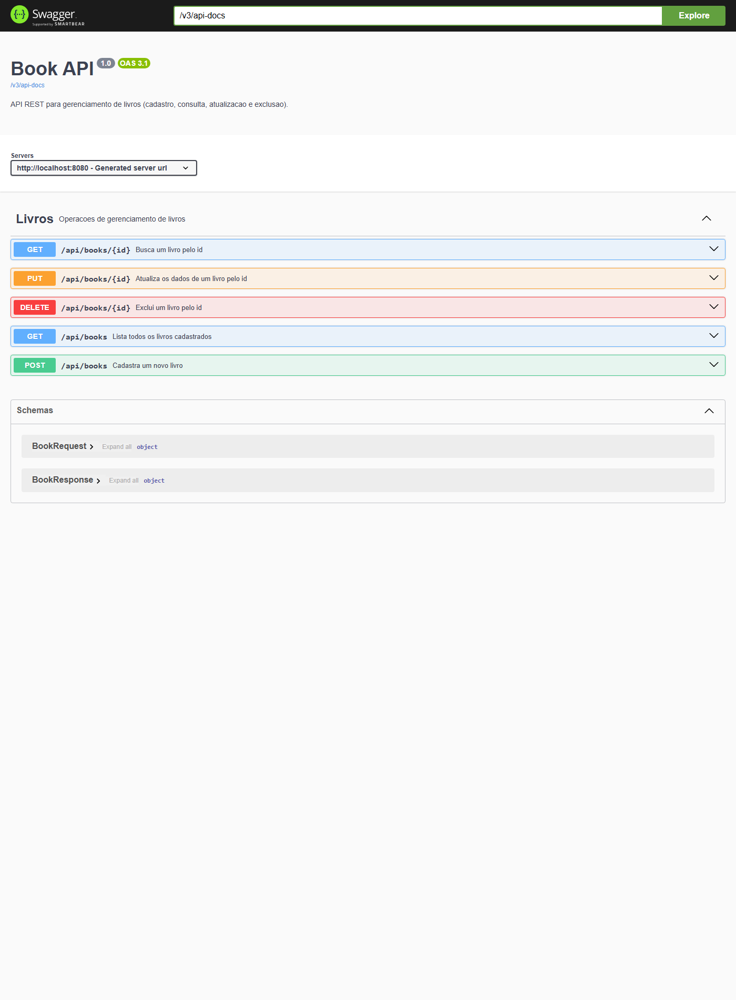
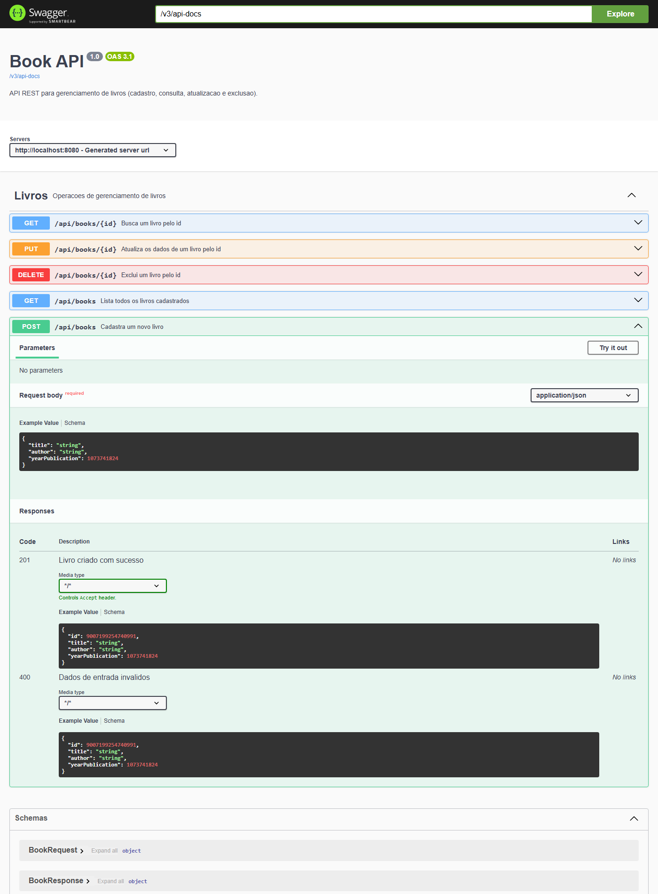

# Book API

API REST para gerenciamento de livros, desenvolvida com Spring Boot. Permite cadastrar, consultar, atualizar e excluir livros, com persistência em banco de dados H2 em memória.

---

## Índice

- [Tecnologias](#tecnologias)
- [Decisões técnicas](#decisões-técnicas)
- [Arquitetura](#arquitetura)
- [Como executar](#como-executar)
- [Documentação das rotas](#documentação-das-rotas)
- [Exemplos de uso](#exemplos-de-uso)
- [Tratamento de erros](#tratamento-de-erros)
- [Swagger / OpenAPI](#swagger--openapi)
- [Banco de dados (H2)](#banco-de-dados-h2)
- [Testes](#testes)

---

## Tecnologias

| Tecnologia | Versão | Papel |
|---|---|---|
| Java | 21 | Linguagem |
| Spring Boot | 4.1.0 | Framework base (web, injeção de dependências) |
| Spring Data JPA | — | Persistência / acesso ao banco |
| H2 Database | 2.4.240 | Banco de dados em memória |
| Bean Validation | — | Validação dos dados de entrada |
| MapStruct | 1.6.3 | Mapeamento entre DTOs e entidade |
| Lombok | — | Redução de código repetitivo |
| springdoc-openapi | 2.8.6 | Documentação interativa (Swagger UI) |
| SonarQube | — | Análise estática de código e qualidade |
| JUnit 5 | — | Testes |
| Maven | — | Build e gerenciamento de dependências |

---

## Decisões técnicas

- **Spring Boot** — acelera o desenvolvimento de APIs REST com auto-configuração, servidor embutido (Tomcat) e injeção de dependências. É o padrão de mercado para aplicações Java corporativas.
- **H2 em memória** — banco leve, sem instalação, ideal para desenvolvimento e testes. 
- **Spring Data JPA** — implementa o padrão Repository. Também protege contra SQL Injection, pois não há concatenação manual de queries.
- **Arquitetura em camadas + DTOs** — separa responsabilidades (Controller, Service, Repository) seguindo o princípio SRP do SOLID. Os DTOs isolam o contrato da API do modelo de persistência, evitando expor a entidade diretamente.
- **MapStruct** — implementa o padrão de mapeamento gerando o código em tempo de compilação, mantendo o desacoplamento entre as camadas.
- **Lombok** — elimina getters, setters e construtores repetitivos, deixando as classes enxutas e legíveis.
- **Sonar (SonarQube/SonarCloud)** — garante a qualidade do código e a manutenção dos princípios de Clean Code através de análise estática contínua, detectando proativamente bugs, vulnerabilidades e *code smells*.
- **springdoc-openapi (Swagger)** — gera documentação interativa automaticamente a partir dos controllers, atendendo ao critério de documentação de forma navegável e testável pelo navegador.

---

## Arquitetura

O projeto segue uma arquitetura em camadas. Uma requisição percorre o seguinte caminho:

```
Cliente (HTTP/JSON)
   -> Controller   (recebe a requisição, valida a entrada, define status HTTP)
   -> Service      (regra de negócio)
   -> Mapper       (converte DTO <-> Entity)
   -> Repository   (acesso ao banco via Spring Data JPA)
   -> Banco H2
```

Estrutura de pacotes (`src/main/java/com/kailandias/bookapi`):

| Pacote | Responsabilidade |
|---|---|
| `Controller` | Expõe as rotas HTTP e traduz requisições em chamadas ao serviço |
| `Service` | Contém a regra de negócio |
| `Repository` | Interface de acesso ao banco (Spring Data JPA) |
| `Entity` | Modelo de persistência (`Book`) mapeado para a tabela |
| `DTO` | Contrato da API: `BookRequest` (entrada) e `BookResponse` (saída) |
| `Mapper` | Conversão entre DTO e entidade (MapStruct) |
| `Exception` | Exceção de negócio e tratamento global de erros |
| `Config` | Configuração do OpenAPI/Swagger |

---

## Como executar

Pré-requisitos: **Java 21** instalado. (O Maven não precisa estar instalado — o projeto usa o Maven Wrapper.)

Na raiz do projeto:

```bash
# Windows
mvnw.cmd spring-boot:run

# Linux / macOS
./mvnw spring-boot:run
```

A aplicação sobe em `http://localhost:8080`.

Para empacotar o `.jar`:

```bash
./mvnw clean package
java -jar target/bookapi-0.0.1-SNAPSHOT.jar
```

---

## Documentação das rotas

Base: `http://localhost:8080/api/books`

| Método | Rota | Descrição | Corpo | Respostas |
|---|---|---|---|---|
| `POST` | `/api/books` | Cadastra um novo livro | `BookRequest` | `201 Created`, `400 Bad Request` |
| `GET` | `/api/books` | Lista todos os livros | — | `200 OK` |
| `GET` | `/api/books/{id}` | Busca um livro pelo id | — | `200 OK`, `404 Not Found` |
| `PUT` | `/api/books/{id}` | Atualiza um livro pelo id | `BookRequest` | `200 OK`, `400`, `404` |
| `DELETE` | `/api/books/{id}` | Exclui um livro pelo id | — | `204 No Content`, `404` |

### Modelos

**BookRequest** (entrada) — todos os campos são obrigatórios:

```json
{
  "title": "Clean Code",
  "author": "Robert Martin",
  "yearPublication": 2008
}
```

| Campo | Tipo | Validação |
|---|---|---|
| `title` | String | não pode ser vazio |
| `author` | String | não pode ser vazio |
| `yearPublication` | Integer | obrigatório e positivo |

**BookResponse** (saída):

```json
{
  "id": 1,
  "title": "Clean Code",
  "author": "Robert Martin",
  "yearPublication": 2008
}
```

---

## Exemplos de uso

Cadastrar um livro:

```bash
curl -X POST http://localhost:8080/api/books \
  -H "Content-Type: application/json" \
  -d '{"title":"Clean Code","author":"Robert Martin","yearPublication":2008}'
```

Listar todos:

```bash
curl http://localhost:8080/api/books
```

Buscar por id:

```bash
curl http://localhost:8080/api/books/1
```

Atualizar:

```bash
curl -X PUT http://localhost:8080/api/books/1 \
  -H "Content-Type: application/json" \
  -d '{"title":"Clean Code (2nd)","author":"Robert C. Martin","yearPublication":2009}'
```

Excluir:

```bash
curl -X DELETE http://localhost:8080/api/books/1
```

---

## Tratamento de erros

Os erros são tratados de forma centralizada por um `@RestControllerAdvice`.

**404 — livro não encontrado:**

```json
{
  "error": "Book not found with id: 99",
  "timestamp": "2026-07-12T16:41:39.55",
  "status": 404
}
```

**400 — validação de entrada:**

```json
{
  "errors": {
    "title": "title is required",
    "author": "author is required"
  },
  "timestamp": "2026-07-12T16:41:39.55",
  "status": 400
}
```

---

## Swagger / OpenAPI

A documentação interativa é gerada automaticamente pelo springdoc-openapi. Com a aplicação em execução:

- **Swagger UI:** http://localhost:8080/swagger-ui.html
- **Documento OpenAPI (JSON):** http://localhost:8080/v3/api-docs

Pelo Swagger UI é possível visualizar todas as rotas e **testá-las diretamente pelo navegador**.

### Screenshots

Visão geral das rotas no Swagger UI:



Detalhe da rota `POST /api/books`, com o corpo da requisição e as respostas documentadas (201 e 400):



---

## Banco de dados (H2)

O banco é em memória — os dados são reiniciados a cada execução. O console web do H2 fica disponível em:

- **Console H2:** http://localhost:8080/h2-console

Configuração de conexão (padrão de desenvolvimento):

| Campo | Valor |
|---|---|
| JDBC URL | `jdbc:h2:mem:book` |
| Usuário | `admin` |
| Senha | `admin` |

> Observação: o console H2 e essas credenciais destinam-se apenas ao ambiente de desenvolvimento. Em produção, o console deve ser desabilitado e as credenciais externalizadas via variáveis de ambiente.

---

## Testes

Os testes cobrem as operações do serviço (cadastro, consulta, atualização, exclusão e o caso de recurso inexistente), utilizando JUnit 5 com o contexto do Spring e o banco H2.

```bash
# Windows
mvnw.cmd test

# Linux / macOS
./mvnw test
```
